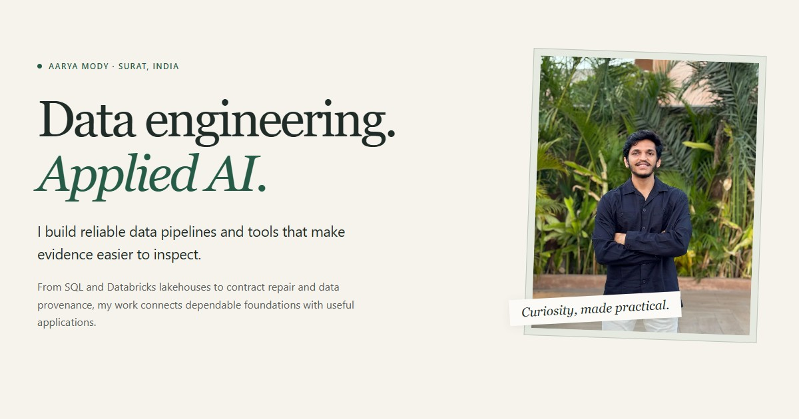

# Aarya’s World — Data Analytics & Engineering

A reading-first portfolio for data analytics and engineering. Built with semantic HTML and an optional floating world, loaded only through Explore world. See [the world guide](docs/aaryas-world.md) and [current verification](docs/aaryas-world-verification.md). A [portable audit summary](docs/release-evidence.json) records the published release, test scope and remaining hosting issue.

[Website](https://aaryamody.app/) · [Resume](assets/docs/AaryaMody_Resume.pdf) · [Content sources](docs/content-sources.md) · [Deployment guide](docs/hostinger-deploy.md)



## What is here

- Three detailed project stories: [DriftDoctor](https://github.com/AaryaMody1301/DriftDoctor), [CompatForge](https://github.com/AaryaMody1301/CompatForge), and [OriginKeep](https://github.com/AaryaMody1301/OriginKeep), with floating islands, illustrative sample demonstrations, and native expandable details.
- Eleven additional public projects, professional experience, skills, credentials, and contact links.
- Responsive layouts, persistent navigation and responsive native dialog panels, keyboard focus handling, reduced-motion support, and usable content/navigation without JavaScript.
- Locally hosted images and resume, content-versioned assets, metadata, structured profile data, and a sitemap.
- Browser, accessibility, asset-integrity, and deployment checks, plus a Hostinger upload packager.

No production framework, backend, database, authentication, or external API is required. Three.js, GSAP and Lucide are bundled locally with esbuild. Sound and analytics are off.

## Run locally

Use **Node.js 24 LTS**, npm, and Git. `.nvmrc` selects the Node major version.

```sh
git clone https://github.com/AaryaMody1301/Personal-Portfolio.git
cd Personal-Portfolio
npm ci
npm run serve
```

Open **http://127.0.0.1:4173/** for reading, or **http://127.0.0.1:4173/?view=world** for World. The server is a local development utility. `npm run serve` prepares the asset filenames before starting it.

After changing a stylesheet, script, or image while the preview is running, run `npm run build` and refresh. Commit the editable source, generated copy, and updated `index.html` together. Text files use LF line endings so the hashes stay identical across operating systems.

## Check the site

Install browsers once for local verification. Tests use installed Google Chrome by default:

```sh
npx playwright install --with-deps chrome firefox webkit
npm run check
npm run test:release
npm test
```

| Command                         | Purpose                                                                                          |
| ------------------------------- | ------------------------------------------------------------------------------------------------ |
| `npm run build`                 | Bundle sources, copy the visual system and regenerate asset hashes                               |
| `npm run profile:world`         | Profile active scene rendering separately from page-load Lighthouse                              |
| `npm run navigation:check`      | Record cold HTTP status and requested/settled routes; hosting challenges fail the check           |
| `npm run links:check`           | Check portfolio links, resources, metadata, CSS URLs and documentation links                     |
| `npm run check`                 | Repository hygiene, syntax, pinned dependencies, and asset integrity                             |
| `npm run assets:prepare`        | Regenerate content-versioned assets and their HTML references                                    |
| `npm run assets:check`          | Verify the generated files without changing them                                                 |
| `npm run assets:environment`    | Optionally rebake desktop sunset reflections locally after changing their source                 |
| `npm test`                      | Seven browser/device configurations, accessibility, interactions, and supported visual baselines |
| `npm run test:ci`               | Browser checks without environment-specific screenshot comparisons                               |
| `npm run test:release`          | Ensure stale or incorrect deployment assets are rejected                                         |
| `npm run audit`                 | Three samples per device and view: default reading and explicit World                           |
| `npm run audit:preview`         | Start a dedicated preview, audit it, and stop it; port 4173 must be free                         |
| `npm run preview:capture`       | Capture four layouts and panels without changing source images                                   |
| `npm run compatibility:capture` | Capture phone/tablet panel states and desktop browser layouts                                    |
| `npm run package:hostinger`     | Build and verify the upload ZIP; requires PowerShell 7 (`pwsh`)                                  |
| `npm run verify:live`           | Compare target deployment bytes, MIME types and metadata with the reference release              |

The suite uses one worker to isolate shared GPU resources in renderer/context-loss checks. The test profiles cover Chrome desktop/Android emulation, WebKit desktop/iPhone/iPad emulation, and Firefox. The reviewed image baselines are for **Windows + Google Chrome**; other environments run the behavioral checks and skip those image comparisons. They do not certify physical iOS or Android hardware. See the [current verification](docs/aaryas-world-verification.md) for current results and limits; [the earlier compatibility audit](docs/history/compatibility-verification.md) records the previous design.

To use Playwright's bundled Chromium instead, install `chromium firefox webkit` and set `PLAYWRIGHT_CHROMIUM_CHANNEL=chromium` in your shell. This is how CI runs. Browser installation on Linux may require permission to install system packages; see [Playwright's CI guide](https://playwright.dev/docs/ci-intro).

All browser, link, capture, Lighthouse and interaction-profile tools accept `PORTFOLIO_BASE_URL`, which defaults to `http://127.0.0.1:4173/`. Reports are separated under `reports/local/` and `reports/live/`. A remote target does not start the preview server. Deployment verification compares against the current checkout by default. For a rollback comparison, extract the saved rollback ZIP into a temporary reference directory and set `PORTFOLIO_REFERENCE_DIR` to that directory; remove the export after byte verification.

Use `npm run preview:capture -- --refresh-social` to regenerate only the reading social card. To intentionally regenerate posters and the social image, use `npm run preview:capture -- --refresh-assets` against localhost, then `npm run build`. Normal captures never modify source images.

Desktop uses `assets/environment/venice-sunset-pmrem.hdr`, filtered ahead of time from the original CC0 `venice-sunset.hdr`. Normal builds use the checked-in result and require no browser for lighting preparation. After changing the source or Three.js version, run `npm run assets:environment`, rebuild, and review the visual/performance checks. The optional bake uses the installed Chrome or `PLAYWRIGHT_CHROMIUM_CHANNEL` and fulfills its requests locally without a server or downloads.

## GitHub Actions

[Portfolio CI](.github/workflows/portfolio-ci.yml) checks pull requests and pushes to `master` or `main` on **Windows and Linux**. It installs locked dependencies and browser engines, checks repository/asset integrity, runs the release and browser tests, and enforces Lighthouse targets of 90 Performance and 95 Accessibility, Best Practices, and SEO.

The Windows job also builds `portfolio-hostinger.zip`. Reports and the ZIP are downloadable workflow artifacts. CI does **not** publish the site, change DNS, or require deployment credentials. The workflow follows the standard [GitHub Node.js setup](https://docs.github.com/en/actions/tutorials/build-and-test-code/nodejs). Dependabot checks development dependencies and Actions monthly.

## Deploy to Hostinger

```sh
npm run assets:prepare
npm run package:hostinger
```

Upload the contents of `output/portfolio-hostinger.zip` to Hostinger's `public_html`. The package contains `index.html`, `.htaccess`, `robots.txt`, `sitemap.xml`, and only required runtime assets. It excludes development tools, repository metadata, reports, and local backups. Every packaged file is checked against its source bytes.

Upload the complete assets before replacing the HTML, clear the host's HTML cache, then set `PORTFOLIO_BASE_URL=https://aaryamody.app/` and run `npm run verify:live`. The public site can differ from a checkout until a package is uploaded. See the [Hostinger runbook](docs/hostinger-deploy.md) for the exact sequence.

## Repository layout

```text
index.html                      Content, navigation, metadata, JSON-LD
src/                            Editable world and navigation modules
assets/css/world.css            Editable visual system
assets/css/style.css            Generated stylesheet
assets/js/                      Bundles, legal notices and generated copies
assets/images/                  Portrait, scene posters, social image and copies
assets/models/                  Optimized, self-contained CC0 GLB scenery
assets/environment/             Locally hosted HDR environment
assets/fonts/                   Locally hosted Syne font
assets/licenses/                Complete third-party notices
assets/manifest.json            Transitive runtime asset hashes
assets/docs/AaryaMody_Resume.pdf Authoritative, unchanged resume
scripts/                        Preview, asset, verification and packaging tools
scripts/tests/                  Deployment-verification regression test
tests/                          Playwright/axe tests and reviewed image baselines
docs/                           Content sources, deployment and dated audits
.github/                        CI, dependency updates, issue and PR templates
```

Evidence links under `reports/`, `output/` and `archive/` refer to local files or CI artifacts and are excluded from GitHub. The committed [audit summary](docs/release-evidence.json) can be read without those folders. Historical audit reports refer to the artifacts produced on their stated dates. The verified local recovery archive and its checksum/removal inventory are under `archive/`. They are ignored and are not fresh-clone prerequisites. Runtime builds need no ignored files.

Audit tools create dated run folders under `reports/local/` or `reports/live/`. Set `PORTFOLIO_REPORTS_DIR` to a unique folder inside `reports/` to group a release's evidence. Reports identify the served HTML and manifest hashes; targeted browser runs belong in a different folder from the full suite. `npm run audit:preview` owns its preview server and rejects a different release. Use `npm run profile:startup` for three fresh Chrome-process startup samples and `npm run profile:world` for separate active rendering measurements.

## Content and contributions

The supplied resume is the authority for professional details. Repository documentation supports personal-project descriptions; preview and release-candidate qualifications must remain visible. Keep metadata and source notes consistent with any content update. See [CONTRIBUTING.md](CONTRIBUTING.md).

## License

Original portfolio code is [MIT](LICENSE). Imported design, font, scenery and library licenses are preserved in [third-party notices](assets/licenses/THIRD-PARTY-NOTICES.txt). If adapting this portfolio, replace Aarya's personal content, resume, and portrait with your own.
